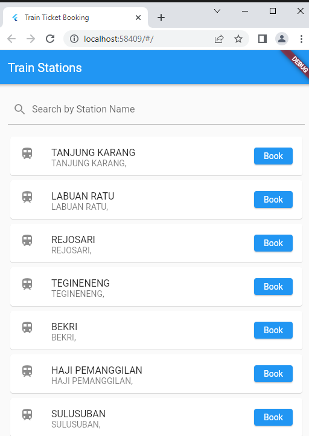
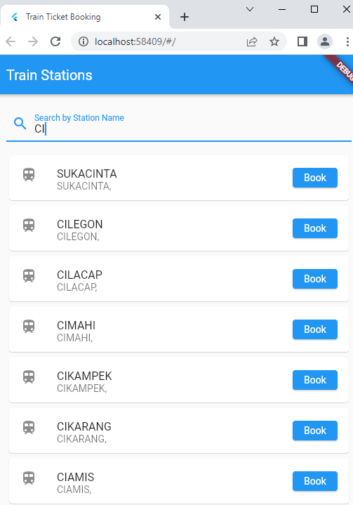
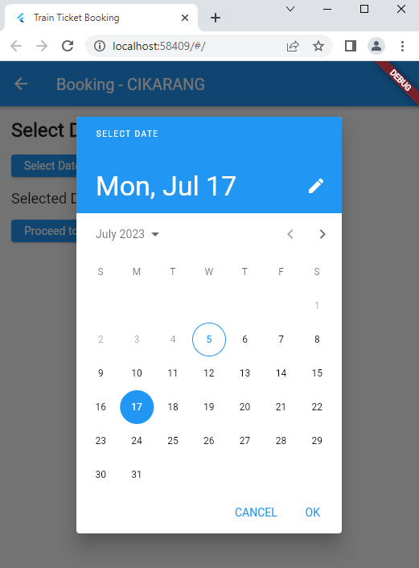
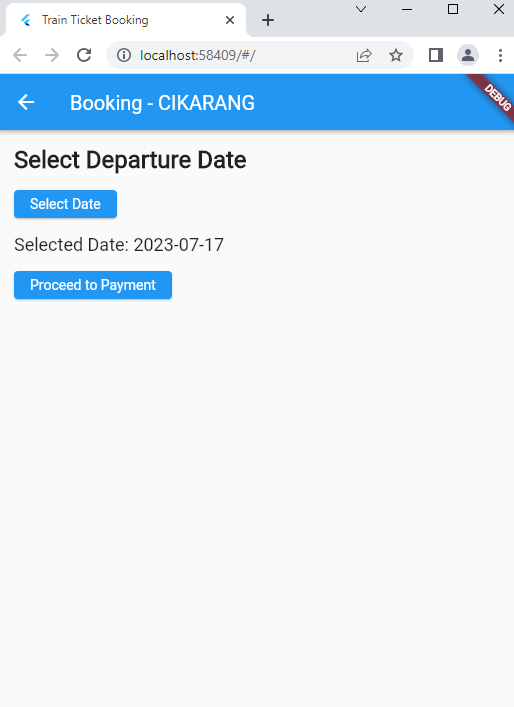
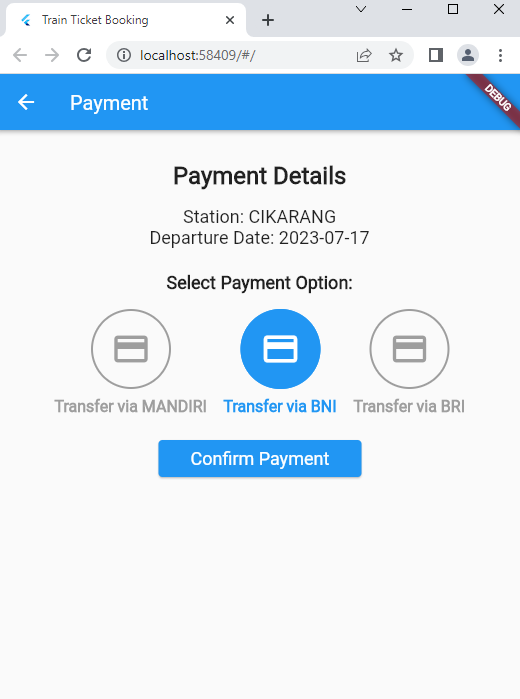
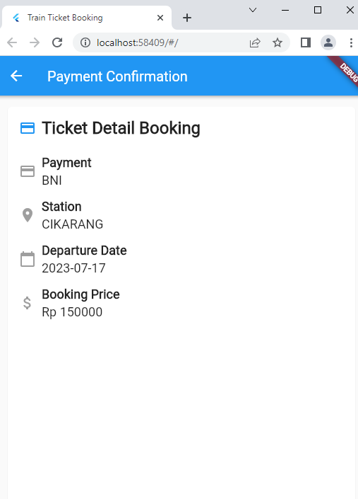

| Herliyansyah          | 312010387             |
|-----------------------|-----------------------|
|  TI.20.A.2            | PEMROGRAMAN MOBILE    |
| UJIAN AKHIR SEMESTER  | MENAMPILKAN DATA API  |

## UJIAN AKHIR SEMESTER

## SEMESTER 6

## MENAMPILKAN DATA API

**Disini saya menggunakan data ***API*** dari github ***https://github.com/farizdotid/DAFTAR-API-LOKAL-INDONESIA#informasi-umum*** sementara link source API nya saya akan lampirkan**

**Source Link API :** **https://booking.kai.id/api/stations2** 

**Yaitu Link API ****Daftar Stasiun Kereta Api di Indonesia**** , diatas adalah Source Link API nya**

Disini saya menggunakan *Framework Flutter* untuk membuat aplikasi *Mobile*

Berikut adalah Tampilan dari Aplikasi API  **Daftar Stasiun Kereta Api di Indonesia**

### 1. Halaman Utama Daftar Stasiun Kereta Api

**Diatas adalah contoh tampilan utama atau halaman utama Daftar Stasiun Kereta Api di Indonesia pada halaman utama terdapat banyak stasiun,jika ingin *booking ticket* Klik Book untuk ke halaman berikutnya**

### 2. Fitur Filter Pencarian

**Diatas adalah contoh tampilan fitur ***filter*** pencarian dengan memasukan kata kunci atau ***Keyword*** stasiun yang ingin dicari,fitur ini memudahkan orang yang ingin mencari stasiun untuk ***booking*** tanpa harus ***Scroll*** untuk mencarinya**

### 3. Booking Ticket

**Diatas adalah halaman setelah mengklik ***BOOK*** untuk ***Booking Ticket*** atau memesan tiket kereta Api disitu terdapat Tanggal Keberangkatan dan tanggal keberangkatan yang dipilih jika sudah klik ***Proceed to Payment*** untuk pembayarannya**

### 4. Fitur Pilih Tanggal Keberangkatan

**Diatas adalah fitur dalam memilih keberangkatan atau ***Departure*** fitur ini kita dapat memilih keberangkatan yang sesuai setelah itu sistem akan merekam data keberangkatan yang dipilih seperti foto dibawah**

**Sebelumnya memilih keberangkatan tanggal 17-07-2023 dan sistem pada foto diatas merekam data yang dipilih sebagai keberangkatan kemudian pilih ***proceed Payment*** untuk pembayaran.**

### 5. Fitur Pembayaran

**Diatas adalah fitur pembayaran,pada bagian itu terdapat opsional pembayaran via bank,kemudian jika sudah ***confirm payment*** untuk mencetak tiket**

### 6. Cetak Tiket 

**Diatas adalah tiket yang sudah dicetak dengan detail pesanannya**

## Selesai

### TERIMA KASIH

